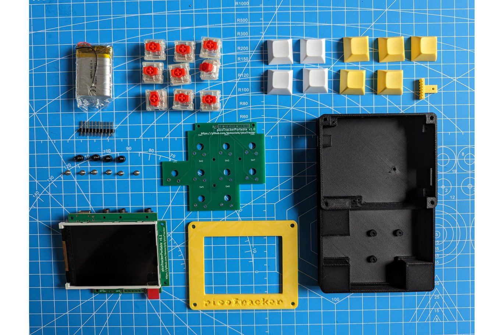

# Build Guide (WIP)

The information currently listed here should be enough to be able to build the picoTracker "portable" if you've done projects like these before. 

## Components

Here are linked examples of sources for the components, but they can be purchased in many different places.

If you go with your own case some of these things can be relaxed. i.e: can use any ili9341 display as long as it's 320x240, can use any MIDI ports, could use the SD card slot that comes with the display (thou I may decide in the future to use SDIO exclusively and that would break your build), etc.

* [PCBs and PCB SMT assembly](https://github.com/democloid/picoTrackerPortable-pcb) can be done at JLCPCB
* [ILI9341 2.8" NO TOUCH NO PCB display](https://www.aliexpress.com/item/1005003732740869.html)
* [3.7V 700mAh 802535 Battery](https://www.aliexpress.com/item/1005005279230561.html)
* [9 x Cherry style switches](https://www.aliexpress.com/item/1005006005139724.html)
* [M3 & M2 screws](https://www.aliexpress.com/item/32810852732.html)
* [*Optional* Keycaps](https://www.aliexpress.com/item/1005003849297167.html)
* [3D printed case](https://github.com/democloid/picoTrackerPortable-case)
* [*Optional* 3D printed keycaps](https://www.thingiverse.com/thing:5180641)

For those that prefer getting a prebuilt version of the kit there is [one currently available](https://www.tindie.com/products/maksmakes/picotracker-kit/).

## Building

Instructions on how to build the kit can be found on the [original blog post](https://democloid.com/2023/06/22/picoTrackerPortable.html). 

There is also [a great video by @FloydSteinberg](https://www.youtube.com/watch?v=BOpA_ZbKLKs) showing how he built a picoTracker portable from a kit. 

There is [also another video](https://www.youtube.com/watch?v=CmtkjvjFl-E) on the final part of the assembly that you may find helpful.

### Soldering

Few tips:

* Be **VERY** careful in aligning and soldering the LCD to the PCB, this is by far the hardest part of the whole build. Here is a useful [video on this topic](https://www.youtube.com/watch?v=4HOeila3rws)
* Use some thin double sided tape to stick down the LCD flexcable before soldering, the whole LCD after soldering (your LCD may already have tape applied to it) and the battery to the PCB. 
