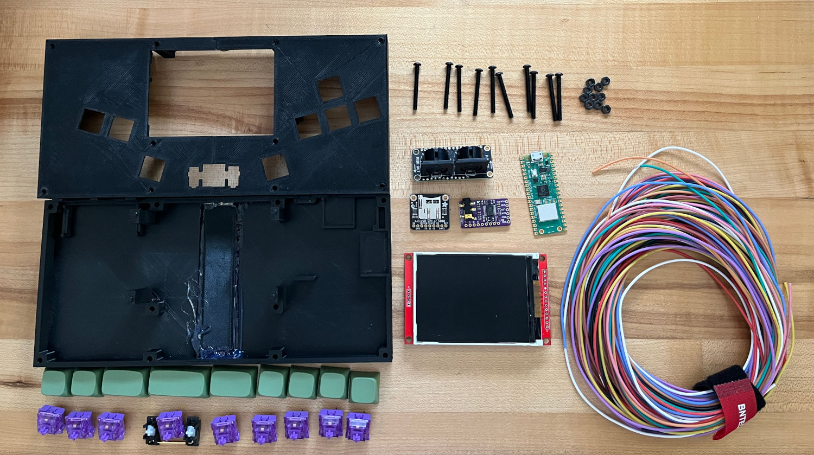
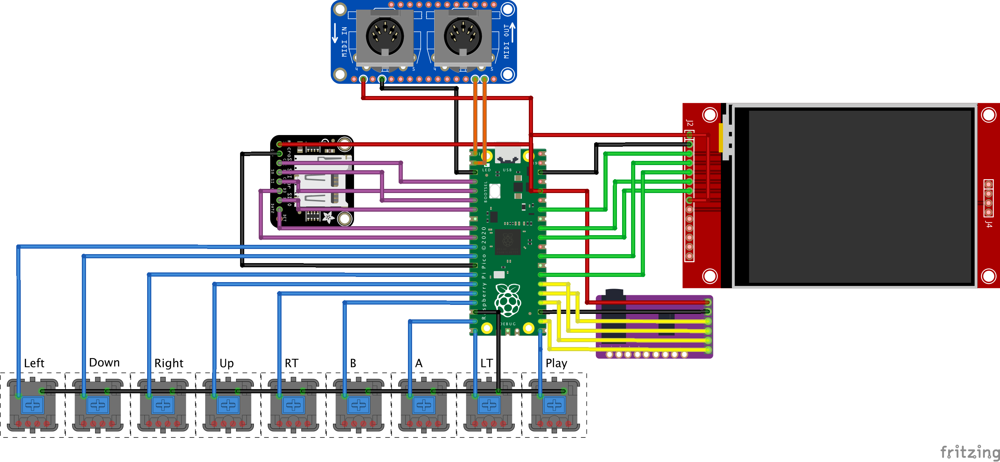
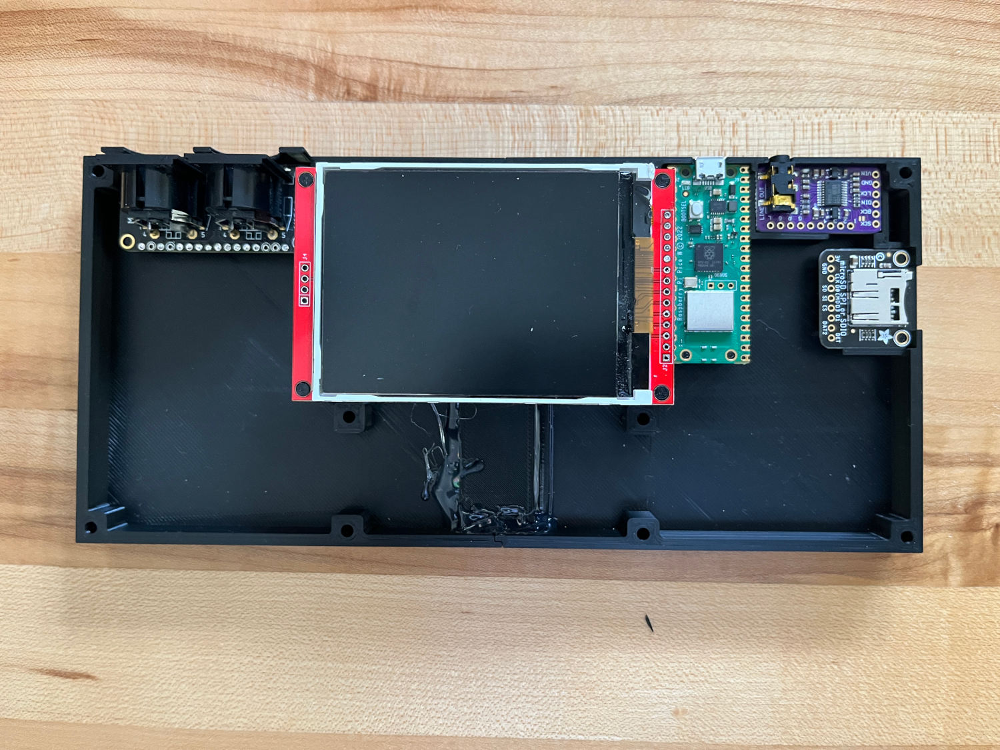
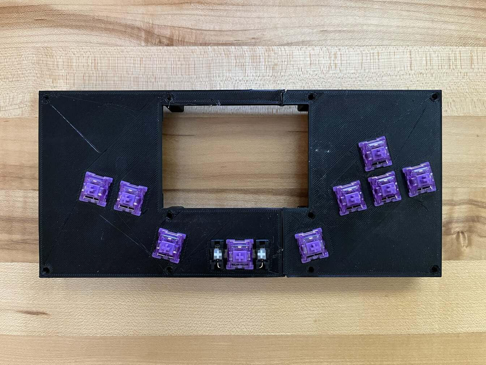
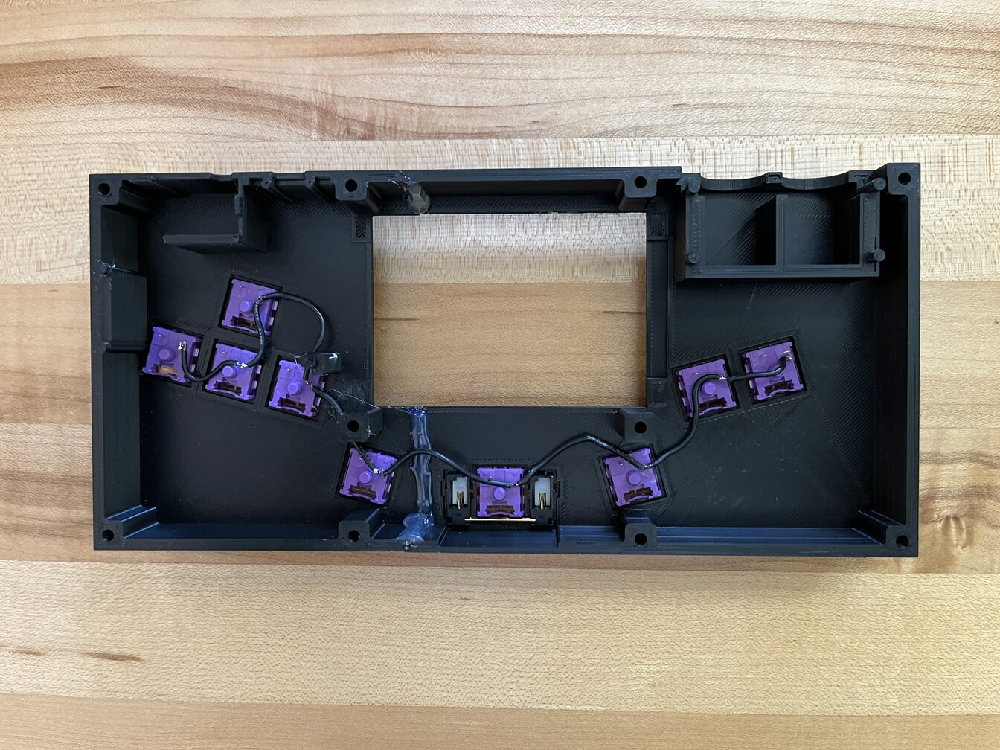
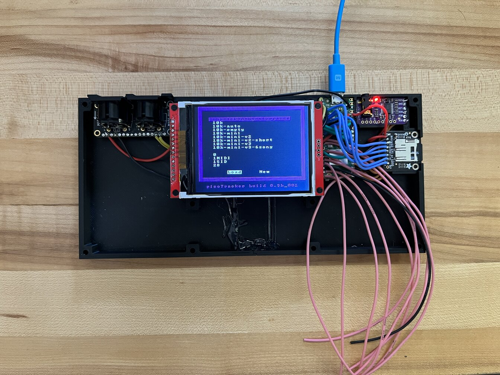
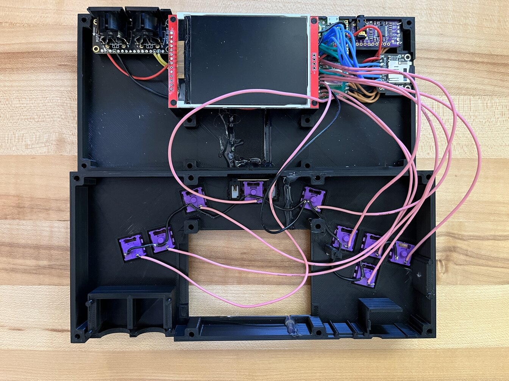
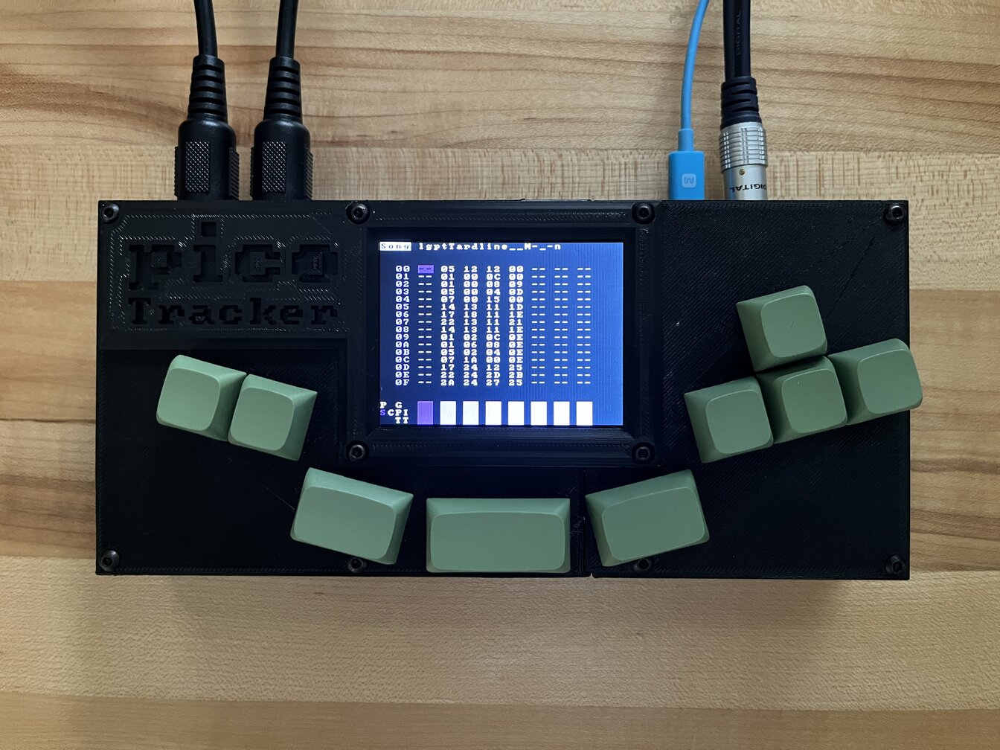

# Build Guide (WIP)

The information currently listed here should be enough to be able to build the picoTracker if you've done projects like these before. 

## Components
I've linked an example of sources for the non obvious components, can be purchased in many different places.

If you go with your own case some of these things can be relaxed. i.e: can use any ili9341 display as long as it's 320x240, can use any MIDI ports, could use the SD card slot that comes with the display (thou I may decide in the future to use SDIO exclusively and that would break your build), etc.

* Raspberry Pi Pico
* [ILI9341 3.2" display](https://www.aliexpress.us/item/3256802819098352.html)
* (optional, for MIDI) [Adafruit MIDI FeatherWing Kit](https://www.adafruit.com/product/4740)
* (optional, for audio) [GY-PCM5102 DAC module](https://www.aliexpress.us/item/3256802711963831.html)
* [Adafruit Micro SD SPI or SDIO Card Breakout Board](https://www.adafruit.com/product/4682)
* 9 x Chery style switches
* 6 x 1u, 2 x 1.5u, 1 x 2u [XDA profile keycaps](https://www.aliexpress.us/item/3256804203440964.html)
* 1 x Plate mount Cherry style stabilizers
* 10 x 30mm M3 screws and nuts
* [3D printed case](https://github.com/democloid/picoTracker-case)

(Screen assembly missing)
## Schematic

Components are oriented in the same way that they go assembled so it's easier to follow the wiring
## Steps

### Case
If your 3D printer bed is not big enough to print the full pieces, you can use the split versions and stick them together. I found that hot glue or epoxy over the seams work pretty well. Pictures are based on a previous version of the design, so it looks a bit different than the released version.

### Component placement

(***NOTE!!***: unfortunatelly I took this picture before building and the display orientation is wrong. Display should go rotated 180 degrees)

### Keypad

### Configuring the GY-PCM5102 module
Some of the modules will come with the bridges in the back unsoldered, you'll need to set them as in the picture.

### Soldering
Few tips:
* Use some thin double sided tape to stick components in place during soldering (can leave permanently, but not necessary)
* It may be asier for assembly if the wiring for the GY-PCM5102 goes from below the board
* For final assembly of the top case, check carefully all the contact points and make sure that cables are out of the way. May be helpful to use tape to get the cables out of the way.

Finally, use the screws and nuts to put everything together

