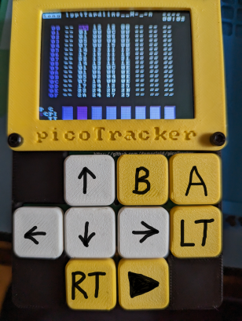
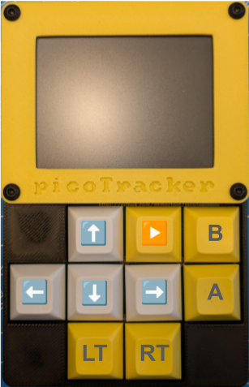
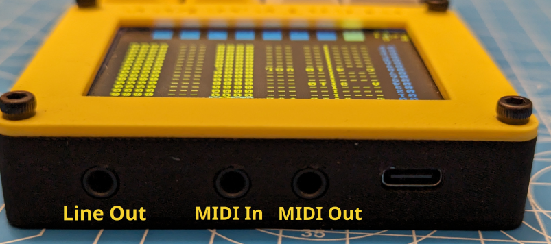
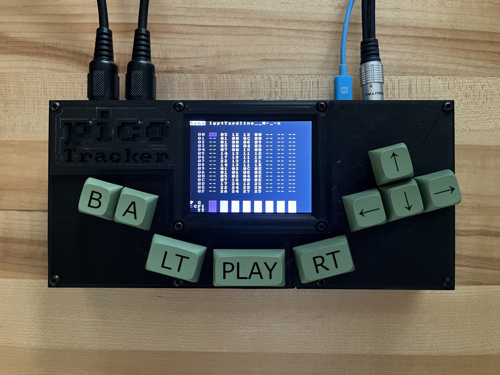

# picoTracker Manual (WIP) 

## Project folders

Project folders use the `lgpt` prefix, any folder with such a prefix will be treated as a project and it's project config file (if it exists) will be read. Projects in subfolders are supported but subfolders cannot be currently created within picoTracker. picoTracker will create all projects at the root of the SD card.

picoTracker cannot directly load lgpt files because it doesn't support all the chains/phrases/tables/instruments as lgpt does and loading the files directly would cause a crash.

## Importing LGPT projects
Under the `util` folder there is a command line tool named `lgptconvert.py` that can be used to convert lgpt projects into picoTracker. This tool is pretty inneficient, it's code is ugly and written pretty lazily, but it *should* work for most projects. If the number of chains/phrases/tables/instruments in the original project doesn't fit picoTracker, it will not output a result (the tool will not verify the size of the `samples` directory). Otherwise an XML project file will be written to STDOUT. Output can be redirected to a file of your choice, but make sure that the resulting file is named `lgptsav.dat`.

```util % python3 lgptconvert.py lgptsav.dat```

## Importing Samples

picoTracker copies samples from the SD card into Flash memory for playing, this limits the amount of samples space to the available flash space *minus* the space taken by the firmware itself, which is currently approximately 1MB. It supports 8 or 16 Bit wav files, any sampling frequency, mono or stereo. 8bit samples are converted to 16bit at load time for compatibility with the engine (you can save space in storage but not in RAM, keep this in mind when choosing samples).

Samples are saved into a `samples` subfolder in each individual project folder. Samples will be placed there when importing using the Instrument Sample Import dialog. They could be copied manually into the project directory in the SD from a computer, but be mindfull of the storage space used, all samples in the `samples` directory of the project will be loaded upon project loading, whether they are assigned to an instrument or not. The safest way is to place any samples into the `samplelib` directory and then load them into projects from the UI.

__NOTE:__ Please be aware that due to a temporary issue with the current picoTracker firmware and limited RAM available, there is a **limit** of 25 sample files per subdirectory inside `samplelib`. Filenames are also temporarily limited to a maximum of 32 ASCII characters.

### samplelib
The `samplelib` folder at the root of the SD card is where picoTracker will look samples to import into projects. You can place as many samples as you'd like here and in any directory hierarchy. Samples can be previewed before importing into projects.

## config.xml

A `config.xml` file can be placed on the root of the SD card. The only configuration options right now are the interface colors and setting the keymap "style". 

This is an example config file:
```
<CONFIG>
    <BACKGROUND value="0F0F0F" />
    <FOREGROUND value="ADADAD" /> <!-- text and cursor in cursor -->
	<HICOLOR1 value="846F94" /> <!-- row count in song screen -->
	<HICOLOR2 value="6B316B" />  <!-- inverted highlight, eg. "Song" screen label -->
    <INFOCOLOR value="33EE33"> <!-- information displays eg. used for battery gauge ok level -->
    <WARNCOLOR value="11EE22"> <!-- warning displays eg. battery gauge low level -->
    <ERRORCOLOR value="FF1111"> <!-- error displays eg. battery gauge critical level -->
    <CURSORCOLOR value="224400">  <!-- ?? -->
    <CONSOLECOLOR value="99FFAA"> <!-- ?? -->
    <KEYMAPSTYLE value="M8" /> <!-- use M8 style keymap layout -->
</CONFIG>
```

The "M8 style" keymap is as shown below:



Note: any value other than "M8" (including not being specified) for the `KEYMAPSTYLE` setting will have the effect of selecting the default "Picotracker style" keymap shown below:




You can head over to the [Little Piggy Tracker Themer](http://poyo.co/lgpt) site to test different color schemes.


## Ports

The picture below shows the functions of the TRS ports on the picotracker:



## Updating firmware
You'll need to do this while powering the picoTracker via a USB connected to a PC. From the project menu select `Update firmware`. This will reboot the device into *BOOTSEL* mode, and you'll see the pico as a USB mass storage device. Just copy the UF2 firmware file into it.

## Shutdown
You can just unplug the machine any time you want other than when saving a project (which is an extremely brief moment). Save your work first if you care about it.

# Controls & Moves

## Key Map



The keyboard layout resembles a typical old console game controller

- Arrow keys: 
- A and B:
- LT and RT: these are modifier keys for A, B and Arrow keys. They are designed to modify the opposite keys to their location, so LT will modify the Arrow keys and RT will modify A and B (there are exceptions).
- Play: play start/stop.

## Basic Editing & Navigation
- ARROWs: In screen navigation.
- A: Insert Chain/Phrase/Note.
- A,A: Insert next unused Chain/Phrase/Instrument.
- RT+(B,A): Clone. This will overwrite the current Highlighted Item with a copy of itself using the next unused Item available.
- B+A: Cuts the current Highlighted Item .
- A+ARROWS: Updates Highlighted Item value.
  - A+UP/DOWN: +/- 0x10.
  - A+RIGHT/LEFT: +/- 1.
- B+ARROWS: Rapid Navigation.
  - B+UP/DOWN: Page up/down in Song Screen, Next/Previous Phrase in Current Chain in Phrase Screen. Navigation +/- 0x10 in Instrument/Table Screen.
  - B+LEFT/RIGHT: Next/Previous Channel in Chain/Phrase Screen. Navigation +/- 1 in Instrument/Table Screen. Switch between Song and Live Modes in Song Screen.
- LT+ARROWS: Navigate between the Screens.
- RT+UP/DOWN: Jump up/down to next populated row after a blank row (great for live mode entire row queuing!)

## Selections

a few ways to make a selection:

- RT+B: Starts selection mode with only the data at the cursor selected
- RT+B+B: Starts selection mode with the cursor's row selected
- RT+B+B+B: Starts selection mode with the entire screen selected

once a selection is started you can do a few more things:

- ARROWS: will make an existing selection bigger or smaller
- B: copy selection to buffer, or
- RT+A: cut current selection

And then:

- RT+A: paste the clipboard content at current location

## Playback Modes and Controls

There are two modes for playback, Song and Live. The controls in each mode differ slightly.
You can switch between the modes by hitting B+LEFT/RIGHT in the Song screen.

**Song Mode**

    START:

In the Song Screen: Starts/Stops song playback from the Highlighted Row. If one of the Row's Channel is marked `--`, LGPT will ignore that Channel entirely for the rest of the playback.
In the Chain Screen: Starts/Stops playback from the Highlighted Step, soloing the Edited Chain.
In the Phrase Screen: Starts/Stops playback from Step `00`, soloing the Edited Phrase.

    LT+START:

Starts song playback from the Edited Row in all screens.

**Live Mode**

    START:

In the Song Screen: Queues from the Highlighted Channel Step.
In the Chain Screen: Queues the Highlighted Phrase Step.
In the Phrase Screen: Queues the Edited Chain Step from `00`.

- The Queued Item will be played as soon as the playing Chain on the Edited Channel reaches its last Step.
- If there is no playing Chain Step on the Edited Channel, the next Song Chain that reaches its last Step will trigger playback.
- Queued Items are shown with a blinking `>`.

    START[again]:

Pressing `START` a second time will queue the Item using Immediate Mode.

- The Queued Item will be played as soon as the playing Phrase on its Channel reaches the last Step.
- Immediate Mode Queued Items are shown with a fast blinking `>`.

    RT+START:

In the Song Screen: Queues all Channel Steps on the current Row.

- The Queued Items will be played as soon as the playing Chain on their Channel reaches its last Step.
- Queued Items are shown with a blinking `>`.

    RT+START[again]:

Pressing `START` a second time will queue the Items using Immediate Mode.

- The Queued Items will be played as soon as the playing Phrase on the their Channel reaches its last Step.
- Immediate Mode Queued Items are shown with a fast blinking `>`.

    LT+START:

In all Screens: Queues the Edited Channel Step to be stopped.

- The Queued Channel will be stopped as soon as its playing Chain reaches the last Step.
- Queued Items are shown with a blinking `_`.

    LT+START[again]:

Pressing `START` a second time will queue the Items using Immediate Mode.

- The Queued Channel will be stopped as soon as its playing Phrase reaches the last Step.
- Immediate Mode Queued Items are shown with a fast blinking `_`.

## Muting

- LT+B: Toggles mute/unmute of cursor channel
  - if LT is released before B, channel stays mutes
  - if B is released before LT, channel goes back to original state
- LT+A: Solo cursor channel
  - if LT is released before A, channel stays solo'ed
  - if A is released before LT, all channel go back to original state
- LT+RT: restore full playback on all channels
- LT+A,LT+B can be used in conjunction with selections. If a selection is present the toggle mute/solo action is done on all channels present in the selection

# Screens

## Screen Map

```
   _-------_                       _-------_
  |         |                     |         |
  |    P    |                     |    G    |
  |         |                     |         |
   project--                       groove---
       ^                               ^
       v                               v
   _-------_       _-------_       _-------_       _-------_
  |         |     |         |     |         |     |         |
  |    S    | <-> |    C    | <-> |    P    | <-> |    I    |
  |         |     |         |     |         |     |         |
   song-----       chain----       phrase---       instrument
                                       ^               ^
                                       v               v
                                   _-------_       _-------_
                                  |         |     |         |
                                  |    T    | <-> |    T    |
                                  |         |     |         |
                                   table----       table----
```

To move from one screen to the other, press LT combined with the direction. To get to the chain screen, you need to have your cursor on a chain in the song. To get to the phrase screen, you need to have your cursor on a pattern in the chain screen.

## Selector Screen

TODO: Screencap

- All the folders you have named as lgptWhatever will show up here.
- Up and Down to select a project, hit A to load the project.
- B+Up/Down will go Up/Down a whole page.

## Project Screen

TODO: screencap

- **Tempo:**: Can be set between 60bpm [0x3c] and 400bpm [0x190]. Resolution aligned to LSDJ.
- **Master:** Main volume goes from 10% to 200%.
- **Transpose:** Live transposition of every triggered instruments.
- **Compact Sequencer:** Free all unused chain/phrases.
- **Compact Instruments:** All unused instruments get their sample set to (null), old parameter settings stick. A dialog offers to remove unused samples.
- **Load Song:** Brings you back to the Selector Screen.
- **Save Song:** Save the work you do, and save frequently! The cursor will disappear while the data is being written.
- **midi:** Lists the picoTracker MIDI device, no external MIDI supported as of this writing.

## Song Screen

TODO: screencap

- Songs are made up of chains. Each hex number on the song screen grid is a chain. You can navigate to any of those chains by putting your cursor on one and hitting LT+Right.
- The top of the song screen displays if you are in SONG or LIVE mode (toggle with B+LT or B+RT) and the name of the project you are editing.
- On the bottom of the screen is the play-time visualizer. Each box correlates with the above columns in the song grid. When a sample is triggered in one of the columns, the note value of that trigger is displayed in the play-time visualizer.
- On the top right of the song screen we have some more play-time statistics. First there is the clip indicator which displays “—---” when your volume levels are ok and “clip” when you've cleared the headroom and are chopping off the top of your samples. The bottom row of the play-time statistics is the amount of time which has passed since you pressed Play.
- You can make a new chain by hitting A,A on a blank space in the song screen grid.
- You can clone a chain by highlighting it with the cursor and pressing RT+(B,A).
- You can copy a chain or selection of chains by highlighting and pressing B.
- You can cut or delete a chain or selection of chains by highlighting and pressing B+A.
- Make a big selection by pressing RT+B, then Arrows around to highlight.
- Press RT+A to paste.
- You can jump the cursor to the next/previous chain in a column by pressing RT+DOWN/UP

## Chain Screen

TODO: screencap

- The three columns of the phrase screen, from left to right: (red) row counter, phrase list, and transpose.
- Chains are made up of phrases. Each hex number in the second column represents a phrase.
- You can navigate to any of those phrases by putting your cursor on one and hitting LT+R.
- The rightmost column is transpose. If you use very high numbers like FF the phrase on that row will transpose down. Low numbers like 04 will cause the phrase on that row to transpose up.
- you can jump to previous / next chain on the row with with B+LEFT/RIGHT
- You can make a new phrase by hitting A,A on a blank space in the Chain screen.
- You can clone a phrase by highlighting it with the cursor and pressing RT+(B,A).
- You can copy a phrase/transposition/selection by highlighting and pressing B.
- You can cut or delete a phrase/transposition/selection by highlighting and pressing B+A.
- Make a big selection by pressing RT+B, then Arrows around to highlight.
- Press RT+A to paste.

## Phrase Screen

TODO: screencap

- The top of the phrase screen displays the .wav file loaded into the instrument under your cursor.
- The seven columns of the phrase screen, from left to right: row counter, note trigger, instrument selector, effect one, parameters for effect one, effect two, parameters for effect two.
- You can clone instruments and tables in the phrase screen: RT+(B,A) as usual. You can get a new table or instrument: A,A.
- If you copy/cut anything in the phrase screen, pasting will always put the data back in the same column (regardless if you've moved the cursor to another column). so effects in column one are always pasted back there, and you can't accidentally paste a note into the effect column, etc.
- you can clone a MIDI instrument in the phrase screen by pressing RT+(B,A) on instrument number in phrase screen. Properly saved & restored. You can't delete them once cloned (can't revert them to sample type).
- If no instrument is set when triggering a new note, tables are not stopped, running commands are not stopped and phase of oscillator instrument is not reset (allowing for clickless transition)

## Instrument Screen

TODO: screencap

- **sample:** selects the .wav file to associate with the instrument. you can select the same sample in more than one instrument. if you tap A,A here it will take you to the Sample Import Screen (which lets you load new .WAV into your project).
- **volume:**
- **pan:** pans the instrument left or right (0x7F is center)
- **root note**
- **detune**
- **drive:** This is a volume modification before crush, and the instruments volume is after the crush.
- **crush:** decrease bit resolution
- **downsample:** decrease the bit rate, get those low frequency aliasing whines. each increase in this value will downsample the original sample by a factor of 2
- **cutoff:** filter cutoff frequency
- **reso:** filter resonance frequency
- **type:** this is where it gets a little trickier. The filter now supports continuous change from low pass to high pass. set type to 00 for low pazz. FF for hi-pass and 7f for Band pass (or is it notch? n0s must check). all intermediate values morph in between them.
- **dist:** filter distortion. for the moment we have none & scream. i'm planning on maybe add a third choice that would make the filter behave a little better when resonance is set very high in the old/default mode

- **interpolation:** Interpolation mode ('linear'/'none'): selects which interpolation mode is used when in between samples. linear interpols linearly while none takes the nearest neighbor. Use none when playing samples at low range to add some typical overtones.
- **loop mode:** selects the looping mode.
  - none will play sample from zero to end.
  - loop will start at zero and loop from loopstart to end.
  - looper sync will automatically tune a loop so that it plays exactly 16 bars. Use the root note to play twice faster/slower
  - oscillator is a special mode where the loop selection (from loopstart to end) is taken as oscillator data and automatically tuned. Experiment with different settings, do not forget 'root note' is your friend to tune the oscillator back in a useful range
- **start:** start point of the sample regardless of if loop is enabled; in hex
- **loop Start:** start point of the sample when loop is enabled; in hex
- **loop End:** end point of the sample; in hex. You can play samples backwards by setting the end value lower than the start!
- **automation:** If On, the table play arrows will advance one row every time the instrument is triggered, and execute only the commands on the new rows. If this is Off, table behavior is normal (play arrows cruise around real fast).
- **table:** Select a table the instrument will always run. Clone a table here: RT+(B,A). Make a new table here: A,A.

## Sample Import Screen

Accessible by hitting A,A on the “sample:” parameter in the Instrument Screen.

All the samples that you may want to import into a project **must** be located in a folder named `samplelib` at the top-level of the sdcard. You can either put your samples in that directory or in sub-directories of it, allowing you to have a basic way of sorting your samples library. 

Note: sub-directories will be sorted before files, but otherwise the files will be listed in an unspecified order (ie. not necessarily alphabetical order).

For example:

TODO: screencap

When entering the import screen, the current folder is the library root folder `samplelib`. All samples (`.wav` files) in that folder are listed.

Use Up/Down to select a sample and the Play button to start/stop preview playback of the sample.
LT+Play to import the currently selected sample and RT+Left to exit out of the Import Dialog back to the Instrument Screen.

Note: While there is no fixed limit for the number of files per sub-directory, exceding 96 sub-directories and/or 354 files per directory is likely to cause picotracker to potentially crash. Also please note that while FAT formatted sdcards can support upto *256* characters per filename, Picotracker only supports upto **128** and with only **ASCII** characters.

## Midi Instrument Screen

TODO: screencap

A midi instrument has the following settings:

- **Channel** - This can be set 0x80 to 0x8F which is midi channel 1-16 respectively
- **Volume** - The volume any NOTE ON will be sent to your device. FF=127, 00=00
- **Length** - Sets note gate length in number of ticks.
- **Automation** - On, the table play arrows will advance one row every time the instrument is triggered, and execute only the commands on the new rows. If this is Off, table behavior is normal (play arrows cruise around real fast).
- **Table**- As above, select a table the instrument will always run. Clone a table here: RT+(B,A). Make a new table here: A,A.

## Table Screen

TODO: screencap

- Hopping to self in table holds the step for x ticks. For example

05 HOP 1005
will hold step 5 for 10 ticks. Interesting for example after a VOL command to allow complex envelopes:
00 VOL 0400 ; starts short volume decay to zero 01 HOP 1010 ; holds enough ticks for VOL to complete 02 VOL 0560 ; raise volume to 60 03 HOP 6003 ; hold for a long time to allow VOL to ; complete and hold volume to 60

- After Hopping count is reached, the table pointer moves directly to the line after

the HOP rather than staying on the HOP line for one tick. Makes more sense.

## Groove Screen

TODO: screencap

Groove screen is located on top of the phrase screen. Groove lets you rock some swing to bust funky beats.
To grasp groove you must first you must know what a tick is, and a tick is simply a constant measurement of time. By default, every row of a phrase (aka step) gets 6 ticks, that's why you see two sixes when you go to the groove screen. But say you change the first 6 to a 1. Now, every other step lasts for 1 tick (which is shorter than 6 ticks).
To get a handle on this, try a groove of 1/F and watch the play arrow in a phrase. You'll notice the play arrow hanging around on the odd steps longer than the even ones. Then try a groove of 1/1/F and go back to the phrase screen. You'll see the play arrow hanging on every third step. Once you grasp how the groove screen effects the play arrow, you can move to more subtle values or keep the beat way freaked out!
In the groove screen there is no copy paste (yet) but the following action exists:

- A: Adds a new step if not existing
- A+Left/Right: modifies current step value
- B+Arrows: modifies current edited groove
- B+A: Clear current step

the GRV command (only active in the phrase screen) select the current groove

# Commands

There can be two commands on every row of the phrase screen. Commands which effect instruments can be run on any step of the instruments playback, including the step where the instrument is triggered.
in vol; pitch and kill but the definition of the “time' is slightly different for all command…

## ARP abcd (ARPG in lgpt)

**cycle through relative pitches a, b, c, and d (starting with original pitch, then up a semitones, b semitones and so forth). The cycle loops if there's only zero's past a given post**
Examples:
ARP 3000: loops between original pitch and +3 semitones
ARP 4050: loops between original pitch, +4 semitones, +0 semitones, + 5 semitones

- speed of arpeggiator is constant and can not be changed
## CSH aabb (CRSH in lgpt)

**aa = pre crush drive (from 1 to 0xFF, 00 is no change) & bb = crush setting (from 0 to 0xF, 0x0 is 1 bit, 0xF is 16bit )**

## DLY --bb (DLAY in lgpt)

**Delays the note to be played by bb tics**

## FCT aabb (FCUT in lgpt)

**adjust the filter cutoff to bb at speed aa**

- FCT 0080 will instantly set the filter cutoff to 50%
- FCT 1000 will close the filter entirely at speed 10
## FLT aabb (FLTR in lgpt)

**lowpass filter, set absolute frequency value for cutoff aa & resonance bb**

- FLT 00FF is un-adultered sound
## FRS aabb (FRES in lgpt)

**adjust the filter resonance to bb at speed aa**

- FRS 08FF will raise the resonance to screeching at speed 08

## HOP aabb

**play position will jump to the next phrase in a chain, jumping directly at position bb in the phrase.**

- hop is instant: instrument triggers and commands on the same row will be run.
- no effect on instruments
- in TABLES, cursor position will jump to row bb aa times, then pass thru the hop command and continue thru the rest of the table

## IRT aabb (IRTG in lgpt)

IRT stands for Instrument Retrigger and will retrigger the current instrument. It gives table the ability to work as progammable phrases that then can be triggered simply by changing tables.
IRT –bb will retrigger the current instrument transposed by bb semi-tones. Note that each IRT transposition is cumulatively added. So a table with
IRT 0001
will keep going a semi tone up. Great for dubby echoes :)
The retriggered instrument is NOT reset (as if you enter a note with no instrument number). The table (obviously) will continue to run and all running variable (filter,etc) won't be reset.
This system is also pretty useful to implement temporary non 4/4 signature without having to switch grooves, since you have the ability to re-trigger the instrument at tick resolution
don't forget trying to combine it with complex hop structure !

## KIL --bb (KILL in lgpt)

**instrument will stop playing after aa ticks.**

## LEG aabb (LEGA in lgpt)

**performs an exponential pitch slide from previous note value to pitch bb at speed aa.**

- 00 is the fastest speed for aa (instant, useless)
- bb values are relative: 00-7F are up, 80-FF are down, expressed in semi-tones
- if LEG is put on a row where a note is present and the pitch offset is 0 (e.g. `C4 I3 LEG 1000`) the slide will occur automatically from previous note to the current one at the given speed.
- If an instrument is not triggered on the same row as LEG, the command will re-trigger the previous instrument (unless the previous instrument is still playing).
- LEG does exponential pitch change (i;e. it goes at same speed through all octaves) while PITCH is linear

## LOF aaaa (LPOF in lgpt)

**LooP OFset: Shift both the loop start & loop end values aaaa digits**

- LOF 0001 adds one to both values, LOF FFFF removes one (so values > 0x800 moves the loop backward)
- reset everytime you start a new note (same as volume, pitch)
- LOF is absolute
- you can't trigger a note with the LOF, it has to be executed after a sample is playing
- every time you trigger a sample LOF is set back to the instrument parameters
## MCC aabb (MDCC in lgpt)

**Sends a MIDI “continuous control” message. aa is the control number and bb is the value. It will be sent on the MIDI channel of the currently running instrument.**

## MPC --bb (MDPG in lgpt)

sends a program change command on the current channel. 0000 is program change 1

## PAN aabb

**PAN aabb: where bb is the pan destination and aa is the speed to get there**

## PFT aabb (PFIN in lgpt)

**PitchFineTune: where bb is the width and aa is the speed to get there**

- Tunes the root note one semitone up (01-80) or down (FF-81)
- 00 in bb returns the note to the root center
- 00 is the fastest speed for aa

## POF aabb (PLOF in lgpt)

**PlayOFfset virtually cuts any sample in 256 chunks. jump absolutely to chunk aa or relatively move forward/back bb chunks.**

## PSL aabb (PTCH in lgpt)

**PitchSLide performs a linear pitch slide from previous note value to pitch bb at speed aa**
- PSL is also time for the first two byte nibble
- PITCH is linear pitch change
For MIDI instruments, this plays as portomento the next note (ie. starts the next note *before* stopping this one)

## RTG aabb (RTRG in lgpt)

**retrigger the sound by looping the from current play position over a certain amount of ticks.**

- aa allows to move the loop forward of aa ticks each time the loop has been done (loop offest per retrigger)
- bb is the number of ticks used for the looping (speed of retrigger effect)

RTG 0001: loop one tick from current play position
RTG 0102: loop of two ticks but move the loop one tick every loop
RTG 0101: does not do anything because after looping one tick, you move forward one tick and therefore go back to the current position :)

## TBL --bb (TABL in lgpt)

**triggers table bb**

## TPO --bb (TMPO in lgpt)

**sets the tempo to hex value –bb.**

- TPO 0000 is safe and doesn't effect the tempo at all.
- TPO 003C (60bpm) is the lowest acceptable value and TPO 0190 (400bpm) is the highest acceptable value

## VEL --bb

Set the velocity of the note being played on the current step for a MIDI instrument. This valid for MIDI instruments *only* and this command is not supported for use in tables.

## VOL aabb (VOLM in lgpt)

**starting from the instrument's volume setting, approach volume bb at speed aa. 00 is the lowest volume and 00 is the fastest speed (instant).**

- to achieve sounds that grow in volume, make an instrument with volume 0 and then apply the VOL command

*NOTE:* For MIDI instruments the VOL command sets the velocity for that step. Only 1 VOL command in the first FX column is supported for MIDI. Only bb is used for velocity, aa has no effect for MIDI instruments.

# Rendering

TBD
